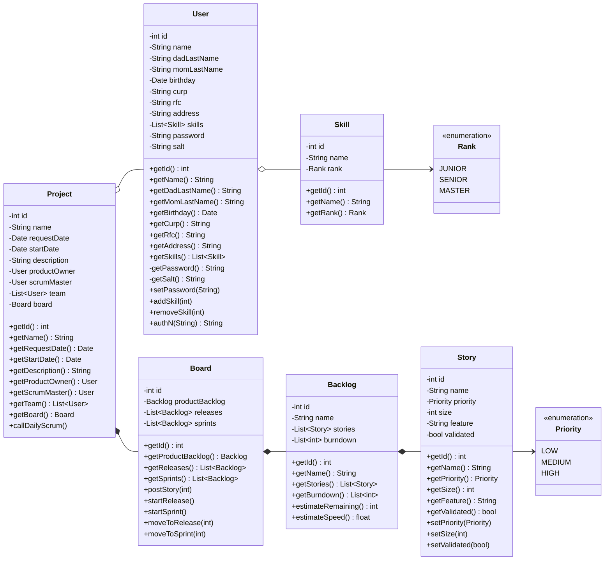

# Proyecto reto II: Desarrollar un manejador de proyectos

## Description:
En esta publicación encontraras el documento que contiene el marco del proyecto a desarrollar durante el curso y tendrá valor en cada evaluación según los criterios de evaluación. Toma en cuenta las siguientes cuestiones:

1) Selecciona tu equipo (el número de integrantes dependerá de lo acordado en clase).

2) Comprendan el documento adjunto y discutan entre los integrantes del equipo.

3) Sí existen dudas pregunten inmediatamente en la publicación o con el profesor en clase.

4) Al final de cada periodo existirá una tarea donde se deberá entregar los puntos a evaluar (uno por cada periodo).

5) Recuerda que se evalúa calidad del código, completitud del proyecto, funcionalidades, entrega a tiempo, participación de todo el equipo y correcta documentación y pruebas.

# Segunda parte:
1) Implemente en su proyecto los componentes de seguridad (JWT y almacenamiento seguro de datos), manejo de ambientes, matriz RBAC, internacionalización y localización.

2) Construya las pruebas usando JEST y Super Test para cada ruta de su proyecto (Respetar la regla del 50%).

3) Comunique su aplicación con el PaaS de Mongodb Atlas.

Como entregable se debe entregar estas tareas concluidas en gitlab y agregar la dirección del servidor web de Heroku donde se encuentra su proyecto de producción, un diagrama de secuencia y un Diagráma de clases (Con los modelos de su proyecto) dentro del archivo readme.md.


### Diagrama de clases




## Work Team:
* Alan Said Sanchez Sausameda 307730
* Andrés Romero Ramos 329540

## Installation:

Usar el manejador de paquetes npm para instalar las dependencias.
```
npm install
```
Para lanzar el proyecto usamos el comando:

```
npm start
```

La app será lanzada en el puerto 3000.

Licencia:

Uso libre.
